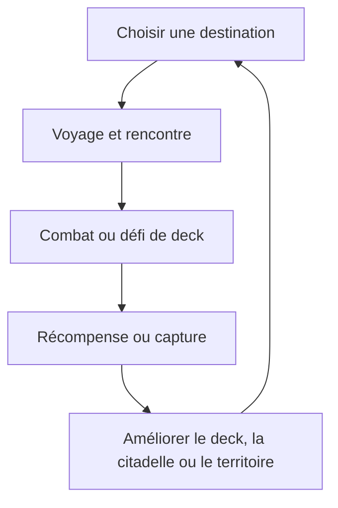

# Fantasia Fauna — Spécification du jeu

> Document de référence pour le design et le code.  
> Remplace l’ancien `prompt.md` (brief initial).  
> Sources : brief d’origine, demandes produit, règles implémentées dans `combat.js` / `campaign.js` / `game.js` / `balance.js`.  
> Guide détaillé des capacités pour non-devs : [`CAPACITES.md`](./CAPACITES.md).

---

## 1. Vision produit

**Fantasia Fauna** est un bestiaire illustré + jeu de cartes type Hearthstone / Magic, centré sur des créatures de capitales/factions.

| Pilier | Description |
|---|---|
| Bestiaire | Liste des cartes, filtres, zoom, cadres de rareté, vote d’art |
| Combat | Duels tour par tour, tours à 30 PV, mana cristallin + mana de couleur |
| Campagne | Progression type Puzzle Quest : world map, citadelle, capture, siège, classeur, boutique |
| Équilibre | Mode spectateur dual-IA + runner headless pour mesurer factions/créatures/IA |

Site public : https://fantasiafauna.com/

---

## 2. Modes de jeu (lobby Combat)

| # | Mode | Rôle |
|---|---|---|
| 1 | **Combat rapide** | 2 factions aléatoires / camp · deck 60 (15 uniques × 4) · vs IA |
| 2 | **Équilibre auto** | Spectateur · les 2 camps en IA · session de 2 parties · log `balance_sessions.jsonl` |
| 3 | **Campagne** | Intro → 2 factions → world map (routes, citadelle, captures, sièges) → classeur / deck / boutique |

Accès campagne aussi depuis lobby / map : Carte, Classeur, Créer un deck, Boutique.

---

## 3. Règles de combat (implémentées)

### 3.1 Structure d’une partie

| Règle | Valeur codée |
|---|---|
| PV de tour | **30** |
| Main d’ouverture | **7** cartes |
| Mulligan | Garder ou **repioche une fois** (même nombre) |
| Pioche / tour | **2** cartes (sauf tour d’ouverture) |
| Main max | **8** (`HAND_MAX`) |
| Plateau max | **8** créatures / camp |
| Mana cristallin | Tour N → `min(10, max(0, N-1))` cristaux (tour 1 = 0, tour 2 = 1… jusqu’à 10) |
| Mana de couleur | Via **Prière** (voir §3.3) · cumul total coloré **≤ 10** · **non régénéré** |
| Premier joueur | Pile ou face 50/50 |
| Victoire | Tour adverse à 0 PV |
| Nul | Les deux tours à 0, ou limite de tours en mode équilibre (≥ 50 tours cumulés) |

### 3.2 Coût d’invocation

Chaque créature a :

- `cost` — coût total affiché
- `costColored` — mana de **sa faction** (minimum **1**, maximum **3** en data)
- `costNeutral` — reste en cristaux (ou surplus de mana de faction)

Règle : **au moins 1 mana spécialisé** de la couleur de la créature.

### 3.3 Prière (mana de couleur)

Implémentation actuelle (remplace le cycle automatique c1/c2… du brief initial) :

- **5 emplacements** de prière par camp
- **1 prière placée par tour** maximum
- Une carte de la main est placée en prière (retirée de la main)
- À la pose : +1 mana de la faction de la carte (si plafond coloré non atteint)
- Chaque début de tour : chaque carte en prière donne encore **+1** mana de sa faction
- Retirer une prière = carte **hors jeu** (pas de retour en main)
- Cumul de tous les manas de couleur ≤ **10**

### 3.4 Placement

- Terrain horizontal : joueur en bas, adversaire en haut
- Invocation : **clic** sur une carte de la main (drag optionnel vers plateau / prière)
- Emplacements comme Hearthstone : 1ʳᵉ au milieu, puis gauche / droite / entre…
- Position gauche/droite importante pour auras adjacentes

### 3.5 Actions de créature

Sur son tour, une créature **prête** peut :

1. **Attaquer** (visée flèche jaune → tour ou mignon), ou
2. **Activer** une capacité `activer-*` (à la place d’attaquer)

Mal d’invocation : pas d’attaque ni d’activation le tour d’arrivée, sauf **Charge** (attaque OK) / **Célérité** (attaque + activation OK).

Combat créature vs créature : frappe + **riposte** (sauf Ranged / sans riposte).  
Tour vs tour : dégâts directs à la tour (30 PV).

### 3.6 Ciblage — Tank, Vol, Ranged, Camouflage

| Règle | Comportement |
|---|---|
| **Tank** | Force le focus : l’adversaire doit frapper un Tank (pas la tour ni les autres), **sauf Ranged** (Vol reste forcé) |
| **Vol** | Seules **Vol** ou **Ranged** peuvent attaquer une créature Vol. Un Vol qui attaque est **toujours** bloqué par un **Tank** adverse ; sinon par un **Vol** adverse ; sinon il peut frapper la tour / le sol |
| **Ranged** | Ignore les Tanks · peut cibler les **Vol** · pas de riposte · peut frapper la tour librement |
| **Camouflage** | Non ciblable tant que la créature n’a pas attaqué / activé |

Socles visuels : ovale portrait ; sprites dédiés Tank / Ranged / Vol (lévitation).

### 3.7 Tour de jeu (résumé)

```
Début de tour → mana cristaux + prières → pioche 2
→ effets début de tour / poison / regen / tank temporaire…
→ phase principale : poser, prier, attaquer, activer
→ Fin du tour → effets fin de tour
→ tour adverse
```

---

## 4. Decks & factions

### Combat rapide / équilibre

- 2 factions par camp (aléatoires, overlap évité si possible)
- **15** créatures les moins chères parmi ces factions · **×4 exemplaires** → **60** cartes

### Campagne

- Choix manuel de **2 factions** (principale + secondaire)
- Starter classeur : cartes bas coût des 2 factions
- Deck campagne : builder « Créer ton deck » après le choix des 2 factions (**15 uniques × 4 max**, auto-build, deck actif obligatoire pour dueler)
- Duels campagne : ennemi en 2 factions aléatoires (même logique de deck)

### Factions

Capitales du catalogue `CREATURES` (Citadelle, Empyrée, Abîme, Manufacture, Bastion, Forteresse, Nécropole, Sylve, Bosquet, etc.).  
Chaque faction a un mana coloré (`FACTION_MANA` dans `game.js`).

---

## 5. Campagne (règles produit)

Inspirée de *Puzzle Quest: Challenge of the Warlords*, avec duels de cartes.

| Élément | Règle |
|---|---|
| Intro | ~3 fenêtres de texte |
| Progression | **World map** (graphe de lieux), citadelle, captures, sièges |
| Récompenses | Or et/ou cartes |
| Fusion | **5** cartes d’une rareté → 1 de la rareté supérieure |
| Raretés (cadres) | normal → bronze → argent → or → or rose → platine → **obsidienne** |
| Booster 100 or | 10 cartes ; upgrade vs normale : bronze 1/5, argent 1/25, or 1/125, or rose 1/625, obsidienne 1/3125 |
| Boutique | Achat cartes / boosters |
| Classeur | Même UI que la liste des cartes, filtrée sur la possession (filtres absents grisés) |
| Deck | Éditable **uniquement** dans un hub (refuge / village / capitale alliée ou conquise) |

### 5.1 World map — vision (Puzzle Quest → Fantasia Fauna)

La carte n’est pas une stratégie type Heroes : c’est une **structure de progression RPG** qui donne du sens aux combats. Boucle cible :



Quatre infos toujours visibles : **Où puis-je aller ?** · **Qu’est-ce qui m’y attend ?** · **Quel deck serait adapté ?** · **Qu’est-ce que je gagnerai ?**

#### Lieux (nœuds)

Graphe fixe de lieux reliés par des routes (pas de déplacement libre). Types :

| Kind | Rôle |
|---|---|
| `home` | Refuge + citadelle |
| `village` | Quêtes, soins, commerce limité, édition de deck |
| `capital` | Grand hub faction ; siège / conquête |
| `lair` | Famille de créatures ; combats + mission Capture |
| `sanctuary` | Défi spécial |
| `ruins` | Récompense rare |
| `fortress` | Siège intermédiaire |
| `shop` / `fusion` | Services |
| `route` | Zone de rencontre / embuscade |

États d’un nœud : `unknown` · `discovered` · `neutral` · `hostile` · `allied` · `conquered` · (évent. `revolt`).

MVP jouable : **~14 lieux**, **4 capitales**, menaces de route visibles, **6 familles** de decks ennemis.

#### Routes & rencontres

- Au plus **une** rencontre forcée par trajet (pas de spam aléatoire).
- Menace **visible** sur la route (Tour de guet / Éclaireur).
- Types : Patrouille · Embuscade · Escorte · Chasse · Blocus · Survie · Duel rituel (MVP : patrouille, embuscade, blocus, capture).
- Monture peut ignorer / fuir selon règles.

#### Deck, compagnon, monture

Le joueur voyage avec un **deck 15×4**, **un compagnon** (bonus contextuel, hors deck), **une monture** (effet world map surtout — pas de gros bonus de combat cumulé).

#### Capture

Après **2–3** victoires significatives contre une famille : mission **Capture** au repaire (défi, pas un 4ᵉ combat identique). Récompense : débloque la carte / variante.

#### Citadelle (bâtiments)

| Bâtiment | Adaptation FF |
|---|---|
| Bestiaire | Créatures rencontrées + lieux |
| Ménagerie | Capture / recrutement |
| Académie | Variantes / spécialisations |
| Forge runique | Améliorations campagne (pas +ATQ/PV permanents des cartes de base) |
| Écurie | Montures |
| Hall des héros | Compagnons |
| Atelier de siège | Conquérir les capitales |
| Cartothèque | Plusieurs decks |
| Tour de guet | Révèle menaces proches |
| Trésorerie | Revenus territoriaux |

MVP bâtiments actifs : Bestiaire, Ménagerie, Tour de guet, Atelier de siège (+ Hall / Écurie via UI compagnon-monture).

#### Sièges

Capitale ennemie : deck propre, tour à **plus de PV**, défenses visibles, éventuellement commandant. Victoire → conquête (deck dans la région, quêtes, recrutement faction, revenu).

#### Ce qu’on évite (défauts PQ)

Pas de combats aléatoires à chaque pas · pas de tribut manuel ville par ville · pas de rébellions purement RNG · pas d’obligation de farmer 10× le même monstre · pas de bonus permanents qui cassent l’équilibrage du deck.

---

## 6. IA & équilibre


## 6. IA & équilibre

### Profils IA (`AI_PROFILES` dans `combat.js`)

| Profil | Comportement |
|---|---|
| `novice` | Coups plus aléatoires, face souvent, peu d’activations |
| `standard` | Heuristique actuelle (létal, trades, tokens évités tôt) |
| `sharp` | Tempo mana, trades de valeur, plus d’activations |

### Mode Équilibre (spectateur)

- Session = **2 parties**
  1. standard vs standard (signal balance)
  2. sharp vs novice (signal skill IA)
- Append JSONL via `POST /api/balance-log` → `balance_sessions.jsonl`

### Headless (sans graphiques)

```bash
node tools/balance_headless.mjs 50
```

Enchaîne N sessions × 2 parties, même log.

---

## 7. Cartes & données

| Fichier | Rôle |
|---|---|
| `creatures-data.js` | Catalogue créatures (stats, `roles`, `abilities`, images) |
| `game.js` | `ABILITIES`, UI liste, cadres, styles |
| `combat.js` | Règles de combat, IA, prière, ciblage |
| `campaign.js` | Campagne, classeur, boutique, deck builder |
| `balance.js` | Sessions équilibre + métriques |
| `audio.js` | Sons créatures |
| `server.py` | Serveur local + promotion art + log équilibre |

Structure créature :

- `roles` : **exactement 1** parmi `normal`, `fast`, `ranged`, `caster`, `tank`
- `abilities` : liste d’ids du catalogue (§11)
- Guidelines d’équilibrage : stats de base **ATQ = C**, **PV = 2×C** ; capacités puissantes → −1/−2 ; sans capa forte → 0 ou +1 ; HP ≥ ATQ ; **max 1 capacité** (sauf combos iconiques : dragons Vol+Piétinement, Ange/Phénix Vol+Bouclier) ; signatures uniques (coût/ATQ/PV/rôle/capacités)

Images : sources **480×480** ; affichage liste ~240 ; aperçu combat taille réelle / carte agrandie.

---

## 8. UI combat (intentions produit retenues)

- Écran combat **non scrollable** (tout visible en hauteur)
- Centre : terrains reliés ; tours (sprites) derrière les créatures
- Journal à gauche + rail d’aide
- Main en bas (déborde sous l’écran) ; survol = effet « tirage » + aperçu latéral
- Visée type Hearthstone (flèche jaune)
- Vote art liste : boutons / promotion #1 via serveur
- **Cimetière** (type Magic) : les créatures mortes en jeu y vont ; vue dédiée pour consulter le sien **et** celui de l’adversaire

---

## 9. Évolution par rapport au brief initial (`prompt.md`)

| Brief d’origine | État actuel |
|---|---|
| Deck 40 / 2–4 couleurs | Deck **60** (15×4) / **2** factions |
| Mana couleur auto cyclique c1…cn | Système **Prière** (5 slots) |
| Phase attaque « déclarer puis bloquer » (Magic) | Ciblage **Hearthstone** (attaquant choisit la cible, riposte auto) |
| Drag-and-drop obligatoire | **Clic** pour jouer (+ drag optionnel) |
| Combat random seul | + Campagne + Équilibre + Headless |

---

## 10. Historique des demandes clés (synthèse)

Demandes utilisateur consolidées (hors bugs UI ponctuels) :

1. Combat jouable type Hearthstone + mana cristal / couleur
2. Images 480, aperçus combat, main / hover / flèche de pose
3. Socles Tank / Ranged / formes type HS
4. Lobby : combat rapide + campagne (classeur magicien)
5. Campagne Puzzle Quest : or, cartes, fusion 5→1, raretés, **world map** (lieux, routes, citadelle, capture, sièges), boutique, boosters
6. Coût : ≥ 1 mana couleur (max 3 colorés)
7. Choix 2 factions en campagne ; decks bas coût
8. Créer un deck (15×4) pour duels campagne
9. Règles **Vol** / Tanks / ciblage
10. Rebalance stats / capacités / quotas Vol & tanks
11. Mode **équilibre auto** spectateur + log ; puis **headless** batch IA
12. Vote / promotion d’illustrations
13. World map RPG : nœuds, rencontres de route, compagnon/monture, citadelle MVP, capture, siège

---

## 11. Catalogue complet des capacités

Source de vérité : objet `ABILITIES` dans [`game.js`](./game.js) (**9** entrées).  
Logique : [`combat.js`](./combat.js). Édition pas-à-pas : [`CAPACITES.md`](./CAPACITES.md).  
**Couverture** : part des **341** créatures de [`creatures-data.js`](./creatures-data.js) qui possèdent la capacité (via `abilities` ou rôle `tank`/`ranged`/`vol`).  
**Puissance** : impact design relatif — ★ faible · ★★ moyen · ★★★ fort (éditable dans `tools/gen_spec.js` → `ABILITY_POWER`).  
Tableau trié par **couverture décroissante**, puis puissance (`node tools/gen_spec.js`).

| Id | Label | Description | Couverture | Puissance |
|---|---|---|---|---|
| `tank` | Tank | Quand un Tank est en jeu, les créatures adverses sont obligées de l'attaquer en priorité (sauf Ranged). | 24.3% (83/341) | ★★★ |
| `ranged` | Ranged | Attaque à distance : ignore les Tanks, peut cibler les créatures volantes, et n’encaisse jamais de riposte (Assassin + Sans riposte). | 22.9% (78/341) | ★★★ |
| `vol` | Vol | Volante : seules Vol ou Ranged peuvent l’attaquer. Contrairement à Ranged, elle est toujours forcée d’attaquer les Tanks ; sans Tank, seuls les Vol adverses la bloquent. | 20.5% (70/341) | ★★★ |
| `pietinement` | Piétinement | Les dégâts qui dépassent les PV du bloqueur sont infligés à la tour adverse. | 10.0% (34/341) | ★★★ |
| `bouclier-divin` | Bouclier divin | À l’invocation : ignore entièrement la première source de dégâts reçue, puis le bouclier disparaît. | 5.0% (17/341) | ★★★ |
| `poison` | Poison | Empoisonne les mignons qu’elle touche en combat, et ceux qui l’attaquent (même sans riposte) : 1 dégât au début de chacun de leurs tours. | 5.0% (17/341) | ★★ |
| `canalisation-1-entrave` | Canalisation 1 : Entrave | Après 1 tour, Entrave une créature adverse (elle ne peut pas attaquer au prochain tour). Réservé aux coûts 5+. | 2.1% (7/341) | ★★ |
| `canalisation-2-entrave` | Canalisation 2 : Entrave | Après 2 tours, Entrave une créature adverse (elle ne peut pas attaquer au prochain tour). Réservé aux coûts 3–4. | 1.8% (6/341) | ★★ |
| `canalisation-3-entrave` | Canalisation 3 : Entrave | Après 3 tours, Entrave une créature adverse (elle ne peut pas attaquer au prochain tour). Réservé aux coûts 1–2. | 1.2% (4/341) | ★★ |


### Modificateurs (syntaxe)

Les **modificateurs** composent une capacité à partir d’un déclencheur + un **sort**. Ils ne sont pas tous actifs sur les cartes aujourd’hui (catalogue réduit), mais le moteur les comprend déjà.

| Modificateur | Forme d’id | Déclencheur | Exemple |
|---|---|---|---|
| *(sort nu)* | `<sort>` | À l’arrivée en jeu | `entrave` — Entrave une créature adverse dès la pose (**pas d’attaque**) |
| **Invocation :** | `invocation-<sort>` | À l’arrivée en jeu (battlecry) | `invocation-entrave` — même effet, libellé « Invocation : » |
| **Canalisation 1 / 2 / 3 :** | `canalisation-N-<sort>` | Après **N** tours du propriétaire (décompte en début de tour) | `canalisation-2-rappel` — dans 2 tours, renvoie une créature adverse en main |

**Sorts** (jamais des effets « à l’attaque ») :

| Sort | Effet |
|---|---|
| `entrave` | La cible ne peut pas attaquer au prochain tour |
| `rappel` | Renvoie une créature dans la main de son propriétaire |

Règles utiles :

- Une carte peut porter un sort nu ou un modificateur via le champ `abilities` (ex. `["entrave"]`, `["canalisation-1-entrave"]`).
- **Canalisation** : à la pose, la créature « canalise » ; un marqueur affiche les tours restants ; à 0, le sort se lance (cible adverse aléatoire non camouflée).
- **Invocation :** (modificateur) ne doit pas être confondu avec d’anciennes pulsations d’invocation de créature (`invocation` / `invocation-rapide` / `invocation-intime`), retirées du catalogue actif.
- Pour réactiver un combo : ajouter l’id composé dans `ABILITIES` (`game.js`) + le mettre sur des cartes dans `creatures-data.js`, puis `node tools/gen_spec.js`.

### Notes

- Catalogue **actif** : Tank, Vol, Piétinement, Poison, Ranged, Canalisation 1/2/3 : Entrave, Bouclier divin.
- `entrave` (sort) est distribué via **Canalisation** selon le coût : 3 (coût 1–2), 2 (coût 3–4), 1 (coût 5+), **~5 % au total** (somme des 3 variantes).
- `bouclier-divin` : à l’invocation, cible ~5 %. `poison` : ~5 %.
- Répartition : au plus **une** de ces capacités spéciales par unité ; équilibre par faction et par coût ; thèmes logiques (venin / contrôle / sacré).
- `pietinement` : surplus de dégâts vers la tour.
- `tank` / `ranged` sont aussi des **rôles** de forme (`roles`) et s’affichent comme badges.

---

## 12. Fichiers liés

| Doc | Contenu |
|---|---|
| [`CAPACITES.md`](./CAPACITES.md) | Comment ajouter / modifier une capacité |
| [`DESIGN.md`](./DESIGN.md) | Tokens UI / chrome |
| [`creatures.md`](./creatures.md) | Référence créatures (doc) |
| [`capitales.md`](./capitales.md) | Lore capitales |
| `tools/balance_headless.mjs` | Simulations sans UI |
| `tools/gen_spec.js` | Régénère ce fichier (`node tools/gen_spec.js`) |

---

*Dernière mise à jour : août 2026 — aligné sur le code courant.*
